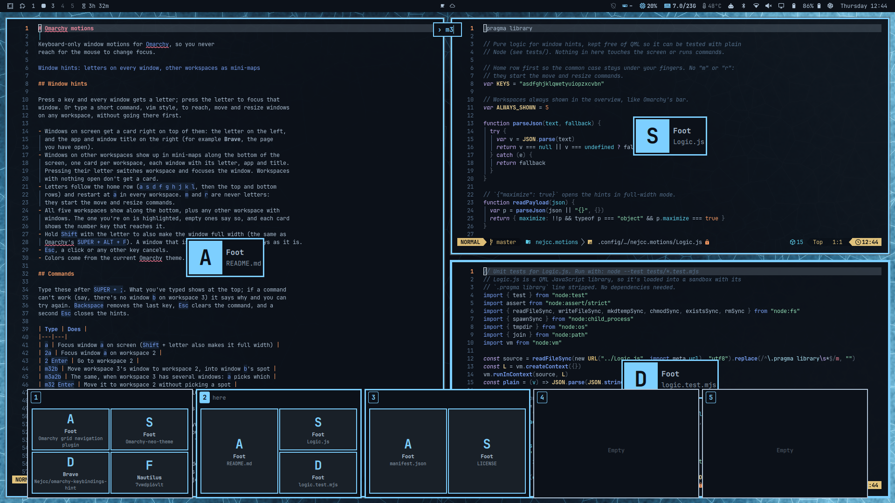

# Omarchy motions

Keyboard-only window motions for [Omarchy](https://omarchy.org), so you never
reach for the mouse to change focus.



## Window hints

Press a key and every window gets a letter; press the letter to focus that
window. Or type a short command, vim style, to reach, move and resize windows
on any workspace, without going there first.

- Windows on screen get a card right on top of them: the letter on the left,
  and the app and window title on the right (for example **Brave**, the page
  you have open).
- Windows on other workspaces show up in mini-maps along the bottom of the
  screen, one card per workspace, each window with its letter, app and title.
  Pressing their letter switches workspace and focuses the window. Workspaces
  with nothing open don't get a card.
- Letters follow the home row (`a s d f g h j k l`, then the top and bottom
  rows) and restart at `a` in every workspace. `m` and `r` are never letters:
  they start the move and resize commands.
- All five workspaces show along the bottom, plus any other workspace with
  windows. The one you're on is highlighted, empty ones say so, and each card
  shows the number key that reaches it.
- Hold `Shift` with the letter to also make the window full width (the same as
  Omarchy's `SUPER + ALT + F`). A window that is already full width stays as it is.
- `Esc`, a click or any other key cancels.
- Colors come from the current Omarchy theme.

## Commands

Type these after `SUPER + ;`. What you've typed shows at the top; if a command
can't work (say, there's no window `b` on workspace 3) it says why and you can
try again. `Backspace` removes the last key, `Esc` clears the command, and a
second `Esc` closes the hints.

| Type | Does |
|---|---|
| `a` | Focus window `a` on screen (`Shift` + letter also makes it full width) |
| `2a` | Focus window `a` on workspace 2 |
| `2` `Enter` | Go to workspace 2 |
| `m32b` | Move workspace 3's window to workspace 2, into window `b`'s spot |
| `m3a2b` | The same, when workspace 3 has several windows: `a` picks which |
| `m32` `Enter` | Move it to workspace 2 without picking a spot |
| `rk6` | Resize window `k` on screen to 6 of 12 columns, like Bootstrap |
| `rk12` | Make window `k` full width |
| `rk1` `Enter` | Resize window `k` to 1 of 12 columns (`1` waits, since `10`–`12` start with it) |

`0` means workspace 10. Moving never takes you anywhere: you stay where you
are, and if the window moves to the workspace you're on it gets focus.
Omarchy's own `SHIFT + SUPER + number` only moves the focused window; this
moves any window between any two workspaces.

Column widths follow your Hyprland gaps and borders, so `rk6` on two windows
side by side gives the same split Hyprland makes itself. In a split, windows
that share a column resize together.

## Requirements

Omarchy with its Quickshell-based shell, on Hyprland with Lua config (older
Hyprland releases fall back to the classic dispatchers). It calls `hyprctl`,
which ships with Hyprland. Nothing else to install.

## Install

```sh
omarchy plugin add https://github.com/Nejcc/omarchy-motions.git --enable
```

Then bind keys in `~/.config/hypr/bindings.lua`:

```lua
-- Window hints
o.bind("SUPER + SEMICOLON", "Jump to window", "omarchy-shell shell toggle nejcc.motions")

-- Window hints that always make the chosen window full width
o.bind("SUPER + SHIFT + SEMICOLON", "Jump to window, full width", "omarchy-shell shell toggle nejcc.motions '{\"maximize\":true}'")

-- Flip between the current and the previously focused window
o.bind("SUPER + APOSTROPHE", "Last window", function() hl.dispatch(hl.dsp.focus({ last = true })) end)
```

These keys are free in the default Omarchy bindings. Pick others if you prefer.
The last-window flip is plain Hyprland and needs no plugin code.

## Usage

| Shortcut | Does |
|---|---|
| `SUPER + ;` | Letters on every window and all workspaces; then a letter or a command |
| `SUPER + SHIFT + ;` | The same, and the chosen window goes full width |
| `Shift` + letter | Full width for that one jump, from the normal hints |
| `SUPER + '` | Flip to the previously focused window; press again to flip back |
| `Esc` | Clear the command, or close the hints |

## Uninstall

```sh
omarchy plugin remove nejcc.motions
```

Then delete the lines you added to `~/.config/hypr/bindings.lua`. The plugin
keeps no settings files.

## Tests

```sh
node --test tests/*.test.mjs   # unit tests for the logic, no dependencies (also run in CI)
tests/smoke.sh                 # live test against your running Omarchy shell
tests/stress.sh                # hard live stress test (takes over the screen; see the script)
FUZZ_ROUNDS=200000 node --test tests/fuzz.test.mjs   # long fuzz run
```

`tests/fuzz.test.mjs` throws tens of thousands of random and hostile inputs at
the logic (broken `hyprctl` output, random key sequences, corrupt settings) and
checks invariants. It runs with the unit tests.

The unit tests cover letter assignment, the workspace overview, multiple
monitors, display scaling, broken `hyprctl` output and the whole command
language: every key sequence up to five keys is checked to be pending, done or
invalid. They also run the real focus, move and resize commands against a fake
`hyprctl`, including values that try to inject shell commands. The smoke test opens and closes the hints, presses real keys
with `wtype` (only the letter of the window that's already focused, so nothing
on screen changes), runs move commands between hidden workspaces 7 and 8
(checking by window address that a swap lands in the right spot) and hammers
it with quick open/close cycles.

## Limitations

- Up to 24 windows per workspace get a letter.
- Resizing works on windows on screen.
- On-screen hints are drawn on the focused monitor only.
- Mini-maps are drawn at the focused monitor's aspect ratio.
- For a few seconds right after login or a shell restart, the key may do
  nothing while the Omarchy shell loads its plugins. This affects every shell
  plugin, not just this one.

## See also

[Keybindings hint](https://github.com/Nejcc/omarchy-keybindings-hint): hold
`SUPER` to see what every `SUPER + key` does, with suggestions for your next
move. It suggests `SUPER + ;` and `SUPER + '` when you have several windows open.

## License

MIT
